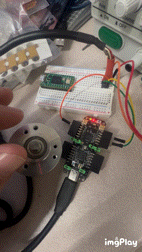

# ice_makefile_quadrature_decoder

Decodes simple AB encoder, lights up onboard LED to indicated direction of rotation. Green for clockwise and red for counter clockwise. Blue is supposed to light up to indicate full rotation (600 pulses) but need to work to lengthen pulse as it currently lasts just one clock cycle. 

  

